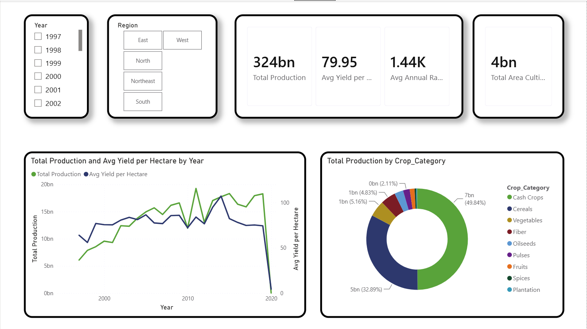

# AgriLens

## Overview 🏝

AgriLens is a data-driven agriculture analytics platform that helps farmers and stakeholders make better decisions using insights from agricultural data.

## DashBoard

### 🔦 Role: Developer

### 🚉 Platform: Web

### 🔧 Tech stack: Power BI, Data Analytics

### 🔗 [Link to repository](https://github.com/rahul18107/Agrilens)
