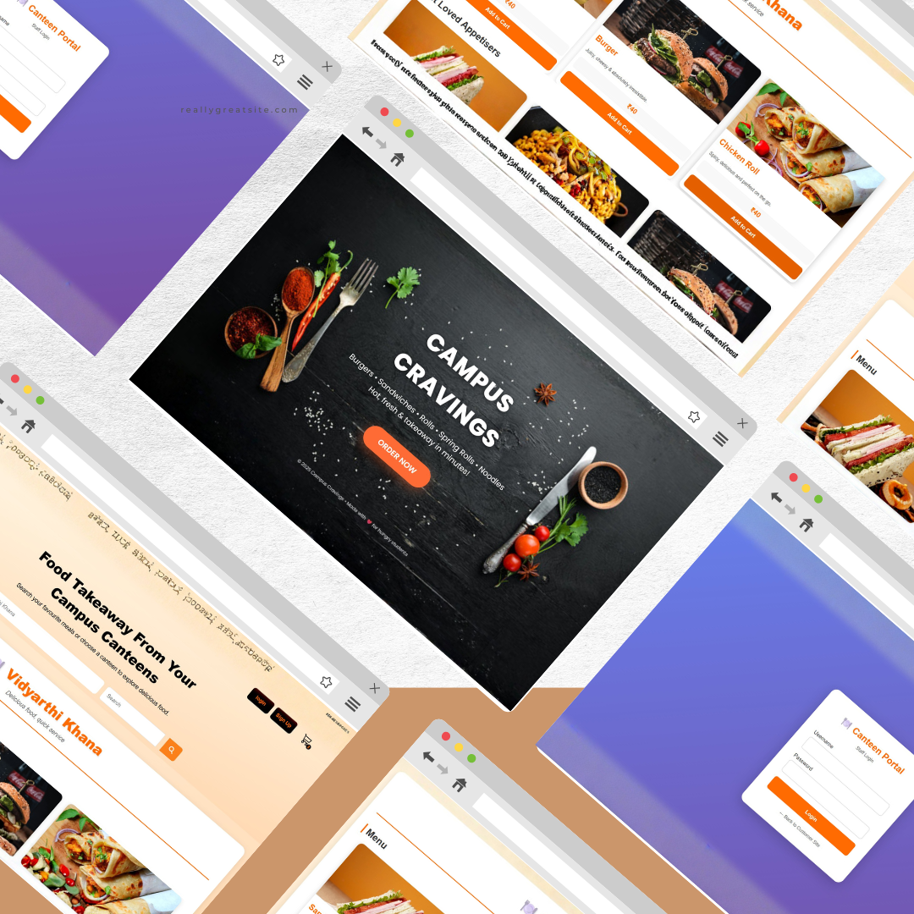

# CampusCravings

## Overview 🏝

### 🎯 Website brief: `A web-based platform for ordering food from your college canteen`

### 🔦 Role: Developer

### 🚉 Platform: Web

### 🔧 Tech stack: HTML, CSS, JavaScript, Node.js, Express.js, MongoDB, Mongoose, JWT

### 🔗 [Link to repository](https://github.com/rahul18107/campuscravings)
